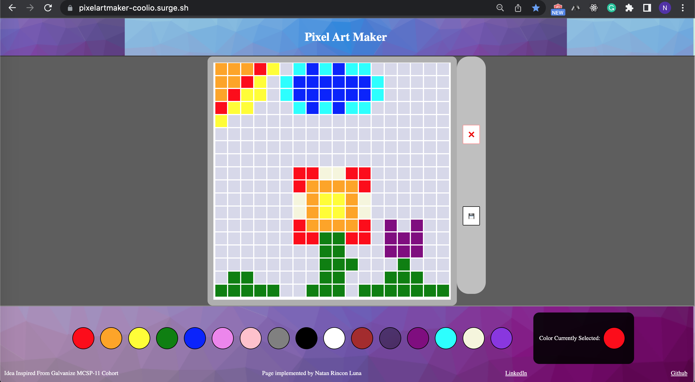

##

# Pixel Art Maker

On this personal projected I decided to make a pixel art maker. The idea originated from a school project. After completing the program I've decided to come back and implement better styling, and overall functionallity while still maintaining the integrity of strictly front end development. 

This web application is a pixel art maker that allows users to select a color from a color pallet and then paint pixel art. 

### Get Started Locally  
1. Fork and clone this repository.
2. Open Live Server 
3. Make some art!!!

### Deployment
Used Surge to deploy this front-end application. 

### Resources
-[Surge] (https://surge.sh/)
- [addEventListener](https://developer.mozilla.org/en-US/docs/Web/API/EventTarget/addEventListener)
- [className](https://developer.mozilla.org/en-US/docs/Web/API/Element/className)
- [style](https://developer.mozilla.org/en-US/docs/Web/API/HTMLElement/style)
- [querySelector](https://developer.mozilla.org/en-US/docs/Web/API/Document/querySelector)
- [appendChild](https://developer.mozilla.org/en-US/docs/Web/API/Node/appendChild)
